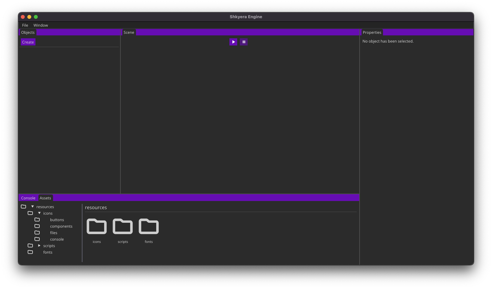

# Shkyera Engine

_Under development. See the progress [here](https://trello.com/b/mVROG8st/shkyera-engine)_

Shkyera Engine is an open-source game engine written in C++, designed to allow Python programmers to create visual applications. The engine's goal is to create a very easy interface that allows for reading user input, creating physical simulations and basic rendering.

See the [documentation](https://fszewczyk.github.io/shkyera-engine) for a comprehensive guide and tutorials.

Requirements

1. [Python](https://www.python.org/)
2. [CMake](https://cmake.org/)
3. Compiler supporting C++17, e.g. [Clang 5](https://releases.llvm.org/download.html)

Download the repository with its submodules.

```
git clone --recursive git@github.com:fszewczyk/shkyera-engine.git
```

Enter the root directory of the downloaded repository and run the following command:

```
chmod +x build.sh
```

This will make `build.sh` an executable. Now, we can easily build and run the project in the following way:

```
./build.sh -r
```

This can take a while, but the project should compile and you should see a window that looks somewhat like this.



Follow the tutorials in the [documentation](https://fszewczyk.github.io/shkyera-engine) to learn more about Shkyera Engine capabilities.
